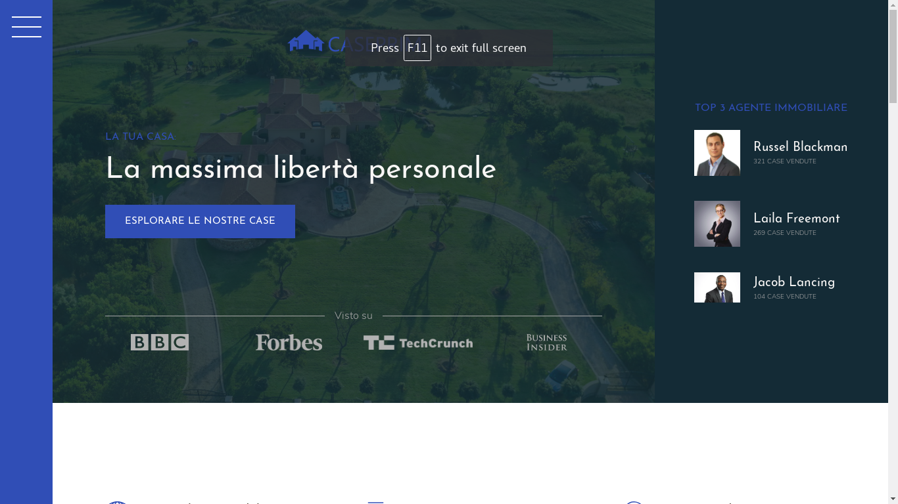
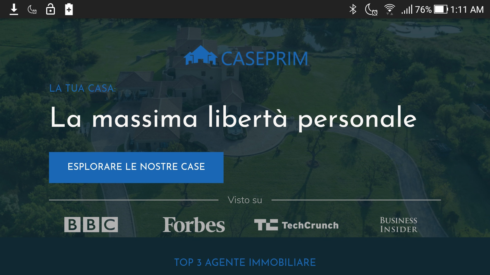
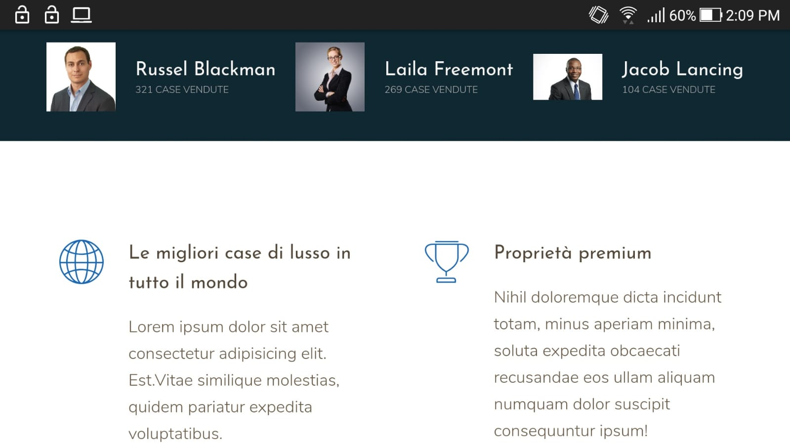
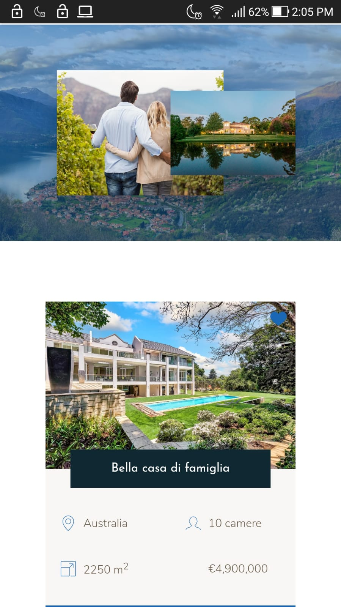

# caseprime
Responsive mock website using CSS Grid & Flexbox

#### Description ####
Mock Luxury Real Estate website built using CSS Grids & Flexbox. Responsive grid layouts depending on device e.g Desktop, tablets or smartphones.

MacBook Air 

Samsung Galaxy Tablet Landscape

Samsung Galaxy Tablet Portrait

Smartphone Landscape

Smartphone Portrait

#### Instructions ####
Requirements to run locally: node, live-server
1. clone or download locally.
2. npm install
3. npm run start (opens in local browser)

#### License ####
GNU GENERAL PUBLIC LICENSE

#### More Info ####
Developed for educational purposes. Should not be used in production or commercial environments. Free to modify as desired.
Updates pending for improvements.
